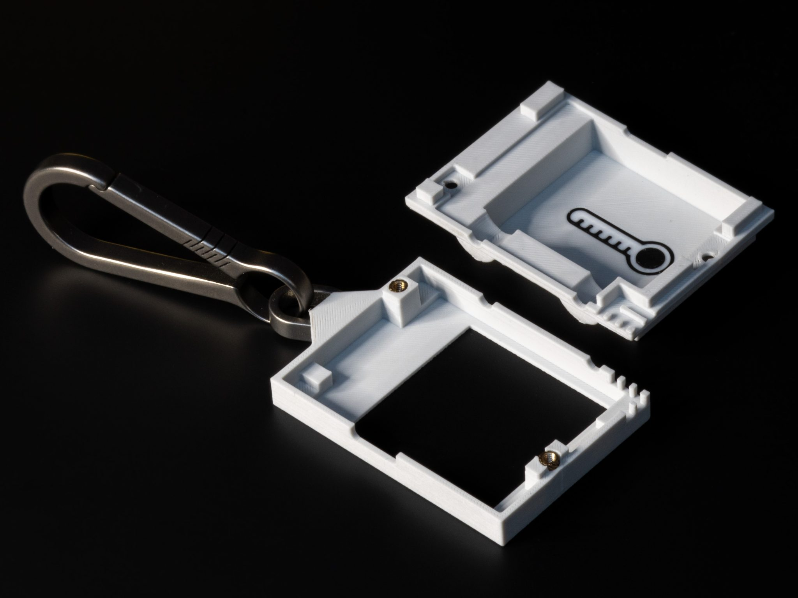
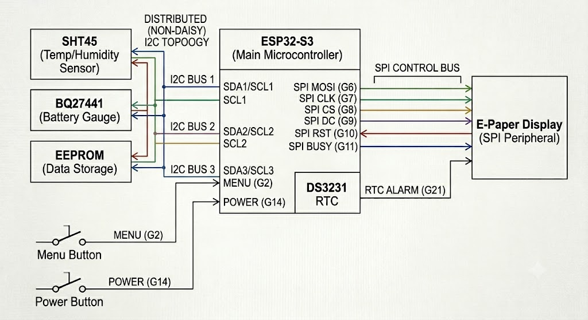

# E-Paper Climate Logger

## About

This project is an open-source, battery-powered temperature and humidity data logger with an always-on e-paper display. It records ambient conditions over time, stores readings in non-volatile memory, and displays current data along with a history graph. The device is designed for low power consumption, achieving weeks of operation on a small Li‑Po battery.

Key features:

- ESP32-S3 microcontroller with deep sleep capability
- SHT45 temperature and humidity sensor
- DS3231 real‑time clock with alarm wake‑up
- 24LC512 external EEPROM for circular data logging
- BQ27441 fuel gauge for accurate battery monitoring
- BQ24075 power path and charging management
- LTC2954 soft power button controller for true on/off
- 1.54‑inch e‑paper display (SPI, GxEPD2 driver)
- Custom 4‑layer PCB (3 cm × 4 cm)
- Parametric 3D‑printed case (OpenSCAD)

The entire project is open source, including hardware schematics, PCB layout, firmware, and enclosure CAD files. A detailed build video is available on YouTube: [E-Paper Climate Logger](https://www.youtube.com/watch?v=I44iGj7gLGA).




[](https://youtu.be/I44iGj7gLGA)

## Repository Structure

```
E-Paper-Climate-Logger/
├── CAD/                 # 3D case design (OpenSCAD source and STL exports)
├── PCB/                 # KiCad hardware design, schematics, datasheets, references
├── firmware/            # PlatformIO firmware (ESP32-S3, Arduino framework)
├── images/              # Diagrams and photos (e.g., simple‑schematic.png)
├── LICENSE              # License file
└── README.md            # This file
```

### CAD

Contains the parametric OpenSCAD models for the front and back case halves, assembly files, and exported STLs for 3D printing. The design is fully parametric – dimensions can be adjusted by editing `constants.scad`.

### PCB

All hardware design files for the custom mainboard (`templog_mainboard`). This directory includes:

- KiCad project files (`.kicad_sch`, `.kicad_pcb`, `.kicad_pro`)
- Schematic sheets for power management and display driver
- Custom component footprints and 3D models
- Datasheets for all major ICs (charger, fuel gauge, RTC, sensors, etc.)
- Reference schematics from SparkFun and Waveshare

To view or modify the PCB design, install KiCad 7 or later and open `templog_mainboard.kicad_pro`.

### firmware

PlatformIO project for the ESP32‑S3 using the Arduino framework. It handles sensor reading, timekeeping, data logging to EEPROM, e‑paper display updates, button handling, and power management (deep sleep, wake sources). See `firmware/README.md` for detailed build and flashing instructions.

### images

Contains supporting visuals, such as the simplified connection diagram used in documentation.

## Getting Started

### Hardware Prerequisites

- Assembled E-Paper Climate Logger PCB (or a hand‑soldered prototype – note that many components are small and may require reflow soldering)
- 1.54‑inch e‑paper display (compatible with Waveshare pinout)
- 3D‑printed case (files in `CAD/export/`)
- Li‑Po battery (e.g., 450 mAh, single cell)
- USB‑C cable for charging and programming

### Building the Firmware

1. Install [PlatformIO Core](https://platformio.org/install/cli) (or use the PlatformIO extension in VS Code).
2. Navigate to the `firmware` directory.
3. Connect the device via USB‑C.
4. Run:

   ```
   pio run --target upload
   ```

5. Monitor serial output (optional):

   ```
   pio device monitor
   ```

For detailed firmware documentation, including folder structure, driver details, and low‑power operation, refer to `firmware/README.md`.

### Enclosure Assembly

Print the STL files from `CAD/export/` using a high‑resolution FDM printer (0.1 mm layer height recommended). The case uses a snap‑fit design; no screws or glue are required. Insert the PCB and battery, then press the front and back halves together.

## Hardware Overview

A simplified schematic of the main connections is shown below. All I2C peripherals (SHT45, DS3231, 24LC512, BQ27441) share the same bus. The e‑paper display is driven via SPI, and the LTC2954 soft power button controls the BQ24075 power path.



For complete schematics and PCB layout, open the KiCad project in `PCB/templog_mainboard/`.

## Power Management and Low‑Power Operation

The device is designed to run for weeks on a small battery:

- In deep sleep, the ESP32‑S3 draws less than 20 µA. The DS3231 and BQ27441 remain active with negligible current.
- The DS3231 alarm wakes the ESP32 at a configurable interval (default: 1 minute). The ESP32 wakes, logs a reading (about 2 seconds at 50 mA), updates the display, and returns to sleep.
- The LTC2954 provides a true on/off capability. When the device is off, battery drain is less than 1 µA.

## Limitations

- **Temperature accuracy during handling**: The ESP32 generates heat when active, which can affect the SHT45 reading. The firmware reads the sensor immediately upon wake to minimise this error. Prolonged menu browsing or holding the device will skew the ambient reading for several minutes.
- **Display low‑temperature limit**: The e‑paper module is rated for operation above 0°C. Below freezing, the screen may not update reliably. Data logging continues in the background, and display functionality resumes when the temperature rises.
- **No wireless connectivity**: This version does not include Bluetooth or Wi‑Fi data export to maximise battery life. Data can be viewed only on the device screen or retrieved via serial.

## Contributing

Issues, pull requests, and suggestions are welcome. Please follow the existing code style and document any changes to the hardware or firmware.

## License

Refer to the `LICENSE` file in the root directory for licensing terms (open source, permissive).

## Acknowledgements

- SparkFun for the Battery Babysitter reference design
- Waveshare for e‑paper display modules and driver schematics
- The PlatformIO and GxEPD2 communities

For questions or discussions, open an issue on GitHub or visit the YouTube video comments.