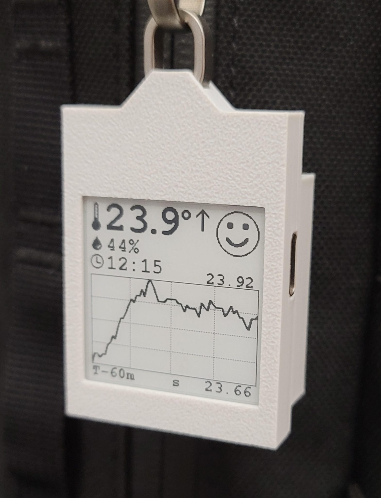
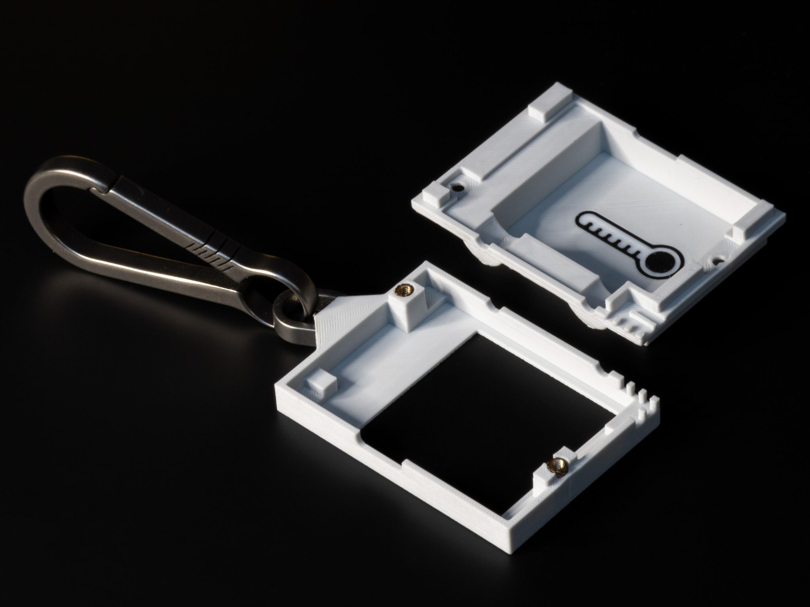
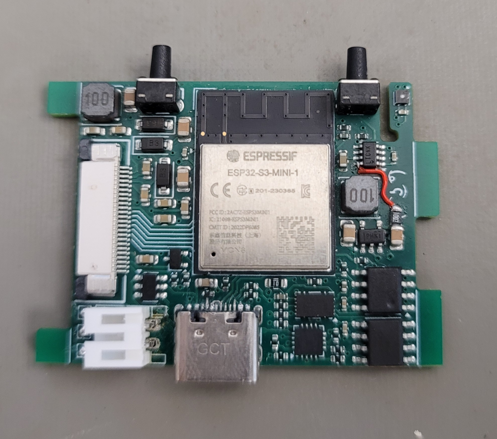

# Weathergotchi - an E-Paper Climate Logger

## About

This project is an open-source, battery-powered temperature and humidity data logger with an always-on e-paper display. It records ambient conditions over time, stores readings in non-volatile memory, and displays current data along with a history graph. The device is designed for low power consumption, over 1 week of operation on a small Li‑Po battery.

Key features:

- ESP32-S3 with deep sleep & RTC timer to wake up
- Temperature and humidity sensor with external EEPROM for logging
- Accurate battery monitoring and charging management
- Power button controller to turn on/off
- 1.54‑inch e‑paper display
- Custom PCB & 3D‑printed case

The entire project is open source, including hardware schematics, PCB layout, firmware, and enclosure CAD files. A detailed build video is available on YouTube: [E-Paper Climate Logger](https://www.youtube.com/watch?v=I44iGj7gLGA).





### Youtube video

[](https://youtu.be/I44iGj7gLGA)

## Repository Structure

```
E-Paper-Climate-Logger/
├── CAD/                 # 3D case design (OpenSCAD source and STL exports)
├── PCB/                 # KiCad hardware design, schematics, datasheets, references
├── firmware/            # PlatformIO firmware (ESP32-S3, Arduino framework)
├── LICENSE              # License file
└── README.md            # This file
```

### CAD

Contains the parametric OpenSCAD models for the front and back case halves, assembly files, and exported STLs for 3D printing. The design is fully parametric – dimensions can be adjusted by editing `constants.scad`.

### PCB

All hardware design files for the custom mainboard (`templog_mainboard`). This directory includes:

- KiCad project files (`.kicad_sch`, `.kicad_pcb`, `.kicad_pro`)
- Schematic sheets for power management and display driver
- Component footprints and 3D models
- Datasheets for all major ICs (charger, fuel gauge, RTC, sensors, etc.)
- Reference schematics from SparkFun and Waveshare

To view or modify the PCB design, install KiCad 9 or later and open `templog_mainboard.kicad_pro`.

### Firmware

PlatformIO project for the ESP32‑S3 using the Arduino framework. It handles sensor reading, timekeeping, data logging to EEPROM, e‑paper display updates, button handling, and power management (deep sleep, wake sources). See `firmware/README.md` for detailed build and flashing instructions.

## Getting Started

### Hardware Prerequisites

- Assembled E-Paper Climate Logger PCB (or a hand‑soldered prototype – note that many components are small and may require reflow soldering)
- 1.54‑inch e‑paper display (compatible with Waveshare pinout)
- 3D‑printed case (files in `CAD/export/`)
- Li‑Po battery (e.g., 400 mAh, single cell)
- USB‑C cable for charging and programming

### Building the Firmware

1. Install [PlatformIO Core](https://platformio.org/install/cli) (or use the PlatformIO extension in VS Code).
2. Navigate to the `firmware` directory.
3. Connect the device via USB‑C.
4. Run:

   ```
   pio run --target upload
   ```

5. Monitor serial output (optional):

   ```
   pio device monitor
   ```

For detailed firmware documentation, including folder structure, driver details, and low‑power operation, refer to [`firmware/README.md`](firmware/README.md).

### Enclosure Assembly

Print the STL files from `CAD/V2/export/` using a high‑resolution FDM printer (0.08 mm layer height recommended). The case uses M2 heat set inserts and M2 screws. Insert the PCB and battery, then screw the front and back halves together. See note.txt in CAD\V2 for more details.

## Hardware Overview

All I2C peripherals (SHT45, DS3231, 24LC512, BQ27441) share the same bus. The e‑paper display is driven via SPI, and the LTC2954 soft power button controls system power-off via the BQ24075.

For complete schematics and PCB layout, open the KiCad project in `PCB/templog_mainboard/`.

## Power Management and Low‑Power Operation

The device is designed to run for over 1 week on a small battery:

- In deep sleep, the ESP32‑S3 draws less than 20 µA. The DS3231 and BQ27441 remain active with negligible current.
- The DS3231 alarm wakes the ESP32 at a configurable interval (default: 1 minute). The ESP32 wakes, logs a reading (about 400 ms at 50 mA), updates the display, and returns to sleep.
- The LTC2954 provides a true on/off capability.

## Issues
- **Battery accuracy issues**: In my testing, the reported battery state of charge is not accurate. I believe this is due to a misconfiguration BQ27441.
- **Low battery issues**: In my testing, when connecting a battery to the device, it will sometimes not turn on until the battery has been connected/disconnected multiple times. 


## Notes on building your own device

I don't have a detailed build guide on how to build your own device at this time, but if you do decide to make one, these are some details you should know.

- First firmware upload requires putting the ESP32-S3 in boot mode. There are three pads near the battery input that expose, BOOT, Enable, and ground. Attaching leads to these pins will allow you to put the ESP32 in boot mode.
- The back of the PCB must be completely flat in order to fit in the case with the screen. After soldering through-hole components. like the buttons, you may need a dremel to flatten the leads/solder on the back of the PCB.


## Troubleshooting

- **Device does not power/stay on:** Ensure the battery is charged to at least 3.7V and try disconnecting/reconnecting the battery. Sometimes the battery must be reconnected multiple times before booting for the first time.
- **Battery percentage inaccurate:** The BQ27441 requires a one-time capacity configuration; refer to the datasheet and adjust `BQ27441.cpp`. The fuel gauge also needs to "learn" the battery before it reports an accurate  state of charge. Fully charge the battery, then wait for it to completely deplete. This will help the fuel gauge report a more accurate charge level.
- **Cannot upload program to the device:** Before uploading for the first time, the device must be manually put in boot mode. See the above note in building your own device.

## Limitations
- **Temperature accuracy during handling**: The ESP32 generates heat when active, which can affect the SHT45 reading. The firmware reads the sensor immediately upon wake to minimize this error. Prolonged menu browsing or holding the device will skew the ambient reading for several minutes.
- **Display low‑temperature limit**: The e‑paper module is rated for operation above 0°C. Below freezing, the screen may not update reliably. Data logging continues in the background, and display functionality resumes when the temperature rises.
- **No wireless connectivity**: While this device has the physical capability for bluetooth and WIFI, The current version of the firmware does not support it or allow you to use the radio to export data. Data can be viewed only on the device screen.

## Contributing

Issues, pull requests, and suggestions are welcome. Please follow the existing code style and document any changes to the hardware or firmware.

## License

Refer to the `LICENSE` file in the root directory for licensing terms (open source, permissive).

## Acknowledgements

- SparkFun for the Battery Babysitter reference design
- Waveshare for e‑paper display modules and driver schematics
- The PlatformIO and GxEPD2 communities

For questions or discussions, open an issue on GitHub or visit the YouTube video comments.